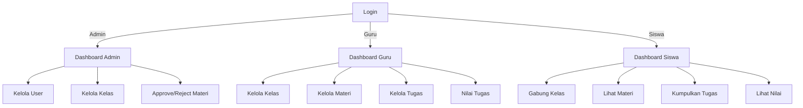

e-learning/
│
├── config/
│   └── config.php          # Koneksi database & setting global
│
├── assets/                 # File statis (CSS, JS, gambar)
│   ├── css/
│   ├── js/
│   └── img/
│
├── uploads/                # Tempat file tugas/materi siswa diupload
│
├── auth/                   # Modul login & register
│   ├── login.php
│   ├── logout.php
│   └── register.php
│
├── dashboard.php           # Dashboard utama
│
├── user/                   # Modul user
│   ├── index.php           # List user
│   ├── tambah.php          # Tambah user
│   ├── edit.php            # Edit user
│   └── hapus.php           # Hapus user
│
├── kelas/                  # Modul kelas
│   ├── index.php           # List kelas (admin/guru)
│   ├── list.php            # List kelas untuk siswa
│   ├── tambah.php          # Tambah kelas
│   ├── edit.php            # Edit kelas
│   ├── hapus.php           # Hapus kelas
│   └── join.php            # Gabung kelas (siswa)
│
├── materi/                 # Modul materi
│   ├── index.php           # List materi (guru/admin)
│   ├── list.php            # List materi (siswa)
│   ├── tambah.php          # Tambah materi
│   ├── edit.php            # Edit materi
│   ├── hapus.php           # Hapus materi
│   ├── view.php            # Lihat detail materi
│   ├── approve.php         # Approve materi
│   └── reject.php          # Tolak materi
│
└── tugas/                  # Modul tugas
    ├── index.php           # List tugas (guru/admin)
    ├── list.php            # List tugas (siswa)
    ├── tambah.php          # Tambah tugas
    ├── view.php            # Lihat detail tugas
    ├── submit.php          # Siswa submit tugas
    ├── nilai.php           # Guru menilai tugas

## 🖥️ Role & Navigasi

